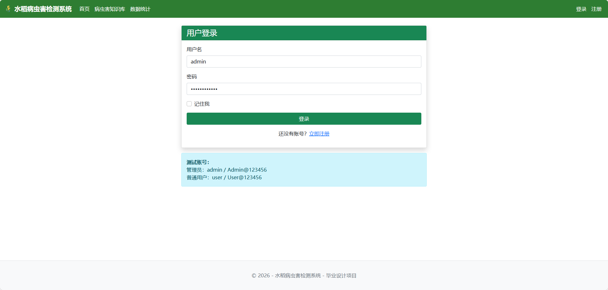
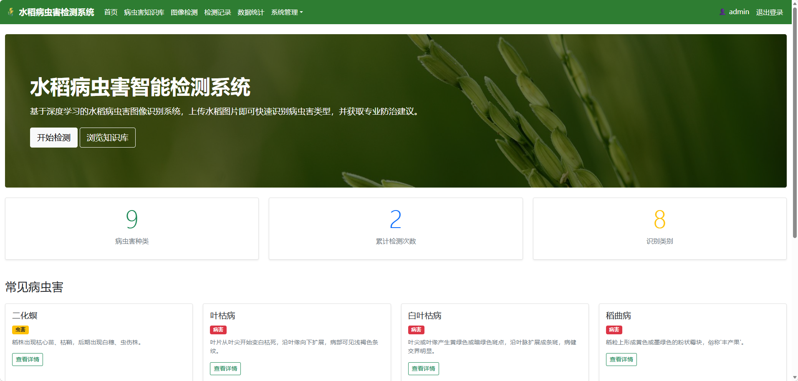
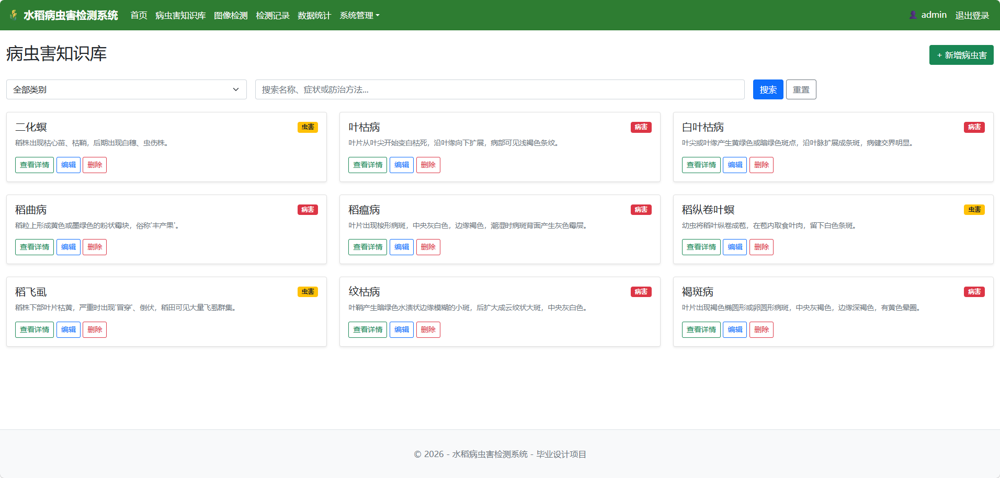
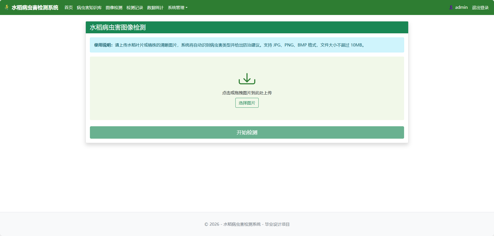
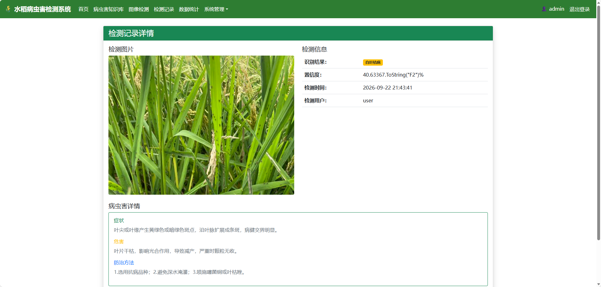
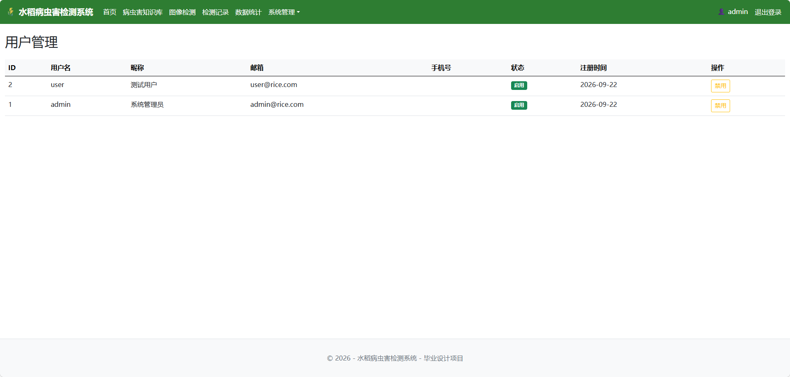
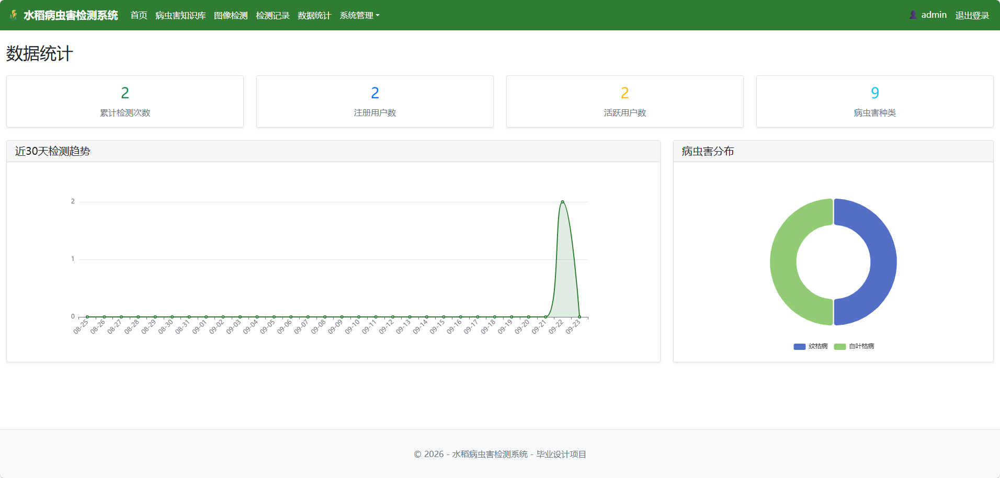

# 水稻病虫害检测系统

基于 ASP.NET Core 8 + ML.NET 的水稻病虫害智能检测系统，用户可上传水稻图片，系统通过 ONNX 预训练模型识别病虫害类型，并提供防治建议。

## 技术栈

- 后端：ASP.NET Core 8、C# 12
- 架构：MVC
- ORM：Entity Framework Core 8（Code First）
- 数据库：SQLite
- 前端：Razor + Bootstrap 5
- 机器学习：ML.NET + ONNX 预训练模型
- 图像：SixLabors.ImageSharp
- 认证：ASP.NET Core Identity

## 环境配置步骤

### 1. 还原依赖

```bash
dotnet restore
```

### 2. 生成数据库（手动执行）

```bash
dotnet ef database update --project src/RicePestDetection.Web/RicePestDetection.Web.csproj
```

> 注意：迁移文件已生成，首次运行会自动创建 SQLite 数据库并初始化种子数据。

### 3. 运行项目

```bash
dotnet run --project src/RicePestDetection.Web/RicePestDetection.Web.csproj
```

### 4. 默认账号

| 角色 | 用户名 | 密码 |
|------|--------|------|
| 管理员 | admin | Admin@123456 |
| 普通用户 | user | User@123456 |

## 项目结构

```
RicePestDetection/
├── RicePestDetection.sln
├── src/
│   └── RicePestDetection.Web/       # Web项目
│       ├── Controllers/             # 控制器
│       ├── Views/                   # Razor视图
│       ├── Models/                  # 实体模型
│       ├── ViewModels/              # 视图模型
│       ├── Services/                # 业务逻辑
│       ├── Data/                    # DbContext、迁移、种子数据
│       ├── wwwroot/                 # 静态资源
│       ├── Program.cs
│       └── appsettings.json
├── tests/
│   └── RicePestDetection.Tests/     # 单元测试
├── models/                          # ONNX模型文件
├── experiments/                     # 实验记录
├── docs/                            # 文档（论文、图表）
└── README.md
```

## 功能模块

1. **用户管理**：注册、登录、角色权限（管理员/普通用户）
2. **病虫害知识库**：浏览、搜索、详情查看；管理员可维护
3. **图像检测**：上传图片 → ML.NET推理 → 展示结果与防治建议
4. **检测记录**：查看历史检测记录
5. **数据统计**：检测趋势、病虫害分布图表
6. **系统管理**：用户管理、操作日志









## 注意事项

- ONNX 模型文件需放置在 `models/rice-pest-model.onnx`
- 上传的图片保存在 `wwwroot/uploads/`
- 数据库文件 `rice_pest_detection.db` 生成在项目运行目录
