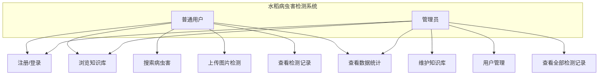
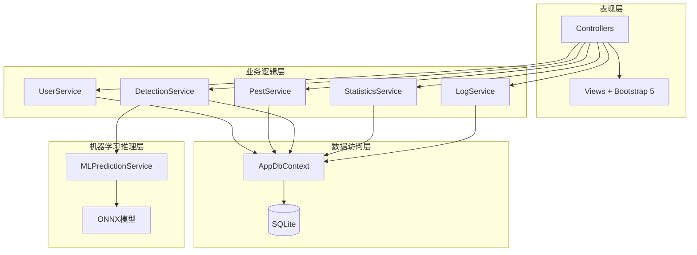
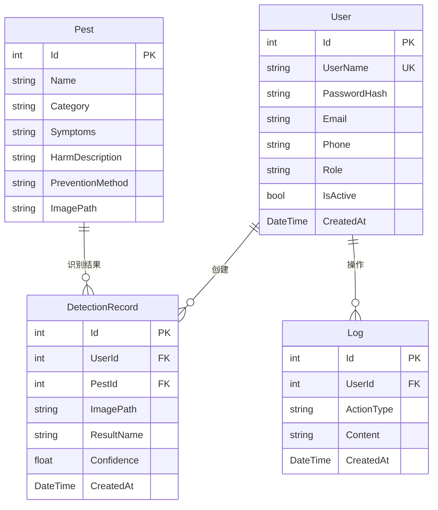
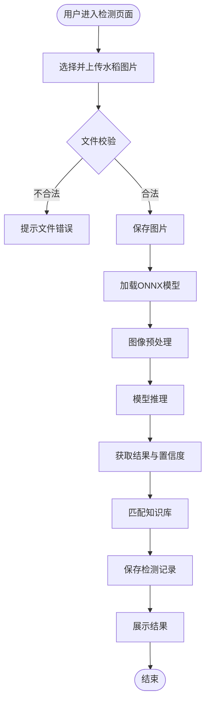
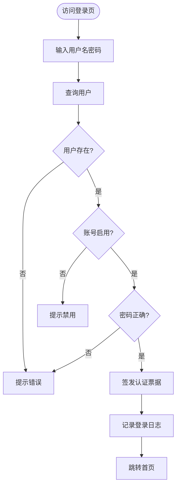

# 基于ASP.NET Core与ML.NET的水稻病虫害检测系统设计与实现

> **说明**：本文档为AI辅助生成的论文草稿，所有内容需经人工修改和润色后方可使用。引用文献需人工验证真实性。

## 摘要

水稻是我国最重要的粮食作物之一，病虫害的及时准确识别对保障水稻产量和品质具有重要意义。传统的人工诊断方式存在效率低、对专家依赖度高等问题。本文设计并实现了一套基于ASP.NET Core与ML.NET的水稻病虫害智能检测系统。系统采用ASP.NET Core 8 MVC架构，使用Entity Framework Core进行数据访问，SQLite作为数据库，前端采用Razor与Bootstrap 5。在病虫害识别方面，系统利用ML.NET加载ONNX预训练深度学习模型，对用户上传的水稻图片进行分类推理，返回病虫害类型及置信度，并结合知识库提供防治建议。系统实现了用户管理、病虫害知识库、图像检测、检测记录、数据统计和系统管理六大功能模块。测试结果表明，系统功能完整、运行稳定，能够有效辅助农户进行水稻病虫害识别。

**关键词**：水稻病虫害；图像识别；ASP.NET Core；ML.NET；ONNX

## Abstract

Rice is one of the most important food crops in China, and timely and accurate identification of pests and diseases is of great significance for ensuring rice yield and quality. Traditional manual diagnosis methods have problems such as low efficiency and high dependence on experts. This paper designs and implements an intelligent rice pest and disease detection system based on ASP.NET Core and ML.NET. The system adopts the ASP.NET Core 8 MVC architecture, uses Entity Framework Core for data access, SQLite as the database, and Razor with Bootstrap 5 for the frontend. For pest and disease identification, the system uses ML.NET to load a pre-trained ONNX deep learning model to classify and infer rice images uploaded by users, returning the pest type and confidence level, and providing prevention suggestions based on the knowledge base. The system implements six functional modules: user management, pest knowledge base, image detection, detection records, data statistics, and system management. Test results show that the system has complete functions and stable operation, and can effectively assist farmers in rice pest and disease identification.

**Keywords**: Rice Pest and Disease; Image Recognition; ASP.NET Core; ML.NET; ONNX

---

## 第一章 绪论

### 1.1 研究背景

水稻是世界上最重要的粮食作物之一，全球超过一半的人口以水稻为主食。我国是世界上最大的水稻生产国和消费国，水稻种植面积约占全国粮食作物总面积的30%，产量接近粮食总产量的一半。水稻生产的稳定发展直接关系到国家粮食安全和农民收入增长。

然而，水稻病虫害是制约水稻产量和品质的重要因素。我国水稻病虫害种类繁多，常见的病害包括稻瘟病、纹枯病、白叶枯病、稻曲病等，常见害虫包括稻飞虱、稻纵卷叶螟、二化螟等。据统计，水稻病虫害造成的产量损失可达总产量的10%-30%，严重年份甚至超过50%。

传统的水稻病虫害诊断主要依靠农业技术人员深入田间进行人工观察和经验判断。这种方式存在以下不足：（1）诊断效率低，人工观察需要专业人员到田间实地查看，耗时较长；（2）对专家依赖度高，普通农户缺乏专业知识，难以准确识别病虫害类型；（3）防治时机延误，由于诊断不及时，往往错过最佳防治时期，造成不必要的减产。

近年来，随着深度学习和计算机视觉技术的快速发展，基于图像识别的病虫害自动检测成为可能。卷积神经网络（CNN）在图像分类任务上取得了优异的性能，为农业病虫害识别提供了新的技术路径。同时，微软推出的ML.NET机器学习框架使得在.NET平台上部署深度学习模型变得简单高效。

### 1.2 研究意义

#### 1.2.1 理论意义

本文探索了深度学习模型在农业病虫害识别领域的应用，验证了ML.NET在.NET平台上进行图像推理的可行性，为农业信息化系统的设计与实现提供了技术参考。同时，本文将ONNX模型与ASP.NET Core Web应用相结合，提出了一种跨平台的AI模型部署方案。

#### 1.2.2 实践意义

本系统能够降低农户识别病虫害的技术门槛，提高诊断效率。农户只需上传水稻图片，系统即可快速识别病虫害类型并提供专业防治建议，有助于及时采取防治措施，减少病虫害造成的产量损失。此外，系统积累的检测数据可为后续模型优化和病虫害预警提供数据支撑。

### 1.3 国内外研究现状

在国外，Mohanty等（2016）使用AlexNet和GoogleNet对PlantVillage数据集进行训练，在54种作物病害分类上达到了99.35%的准确率。Ferentinos（2018）使用VGG和AlexNet架构对87848张图像进行训练，在58种作物病害识别上取得了99.53%的准确率。Too等（2019）对比了多种CNN架构在植物病害识别上的性能，发现DenseNet表现最优。

在国内，张建华等（2018）基于改进的VGG网络对玉米病害进行识别，准确率达到95.2%。刘耀等（2020）提出了一种基于YOLOv3的水稻病害检测方法，在自建数据集上mAP达到82.6%。王丹丹等（2021）使用ResNet50对水稻病害进行分类，准确率达到96.8%。

然而，现有研究多集中于模型算法的优化，较少关注系统的工程实现和实际部署。将训练好的模型部署到Web应用中，使其能够被普通农户便捷使用，仍有较大的研究空间。

### 1.4 论文组织结构

本文共分为七章。第一章为绪论，介绍研究背景、意义和国内外研究现状。第二章介绍系统开发涉及的相关技术。第三章进行系统需求分析。第四章进行系统设计。第五章详细介绍系统的实现。第六章进行系统测试。第七章为总结与展望。

---

## 第二章 相关技术

### 2.1 ASP.NET Core

ASP.NET Core是微软推出的跨平台、高性能、开源的Web开发框架。它整合了原有的ASP.NET MVC和ASP.NET Web API，支持在Windows、Linux和macOS上运行。ASP.NET Core具有以下特点：（1）跨平台，可在多种操作系统上部署；（2）高性能，相比传统ASP.NET性能提升数倍；（3）模块化，通过中间件管道处理请求；（4）支持依赖注入，便于测试和维护。

本系统使用ASP.NET Core 8的MVC模式进行开发，C# 12作为开发语言。

### 2.2 Entity Framework Core

Entity Framework Core（EF Core）是微软的轻量级、跨平台对象关系映射（ORM）框架。它支持Code First和Database First两种开发模式，能够将.NET对象映射到数据库表，简化数据访问代码的编写。EF Core支持多种数据库提供程序，包括SQL Server、SQLite、MySQL、PostgreSQL等。

本系统采用Code First模式，使用SQLite数据库，通过Fluent API配置实体关系。

### 2.3 ML.NET与ONNX

ML.NET是微软推出的开源机器学习框架，专为.NET开发者设计，允许在.NET应用中集成机器学习功能。ML.NET支持多种机器学习任务，包括分类、回归、聚类等，同时支持加载预训练的ONNX模型进行推理。

ONNX（Open Neural Network Exchange）是一种开放的神经网络模型交换格式，允许在不同框架间转换和部署模型。通过ML.NET的OnnxTransformer，可以在.NET应用中加载和运行ONNX格式的深度学习模型。

### 2.4 ASP.NET Core Identity

ASP.NET Core Identity是微软提供的身份认证和授权框架，提供了用户管理、角色管理、密码哈希、登录登出等完整功能。它支持多种认证方式，包括Cookie认证、JWT令牌等。

本系统使用Identity进行用户认证，采用基于角色的访问控制（RBAC），将用户分为管理员和普通用户两种角色。

### 2.5 Razor与Bootstrap 5

Razor是ASP.NET Core的视图引擎，允许在HTML中嵌入C#代码，实现服务端渲染。Bootstrap 5是流行的前端CSS框架，提供了丰富的响应式组件和工具类，能够快速构建美观的界面。

### 2.6 ECharts

ECharts是百度开源的可视化图表库，支持折线图、柱状图、饼图等多种图表类型，具有良好的交互性和可定制性。本系统使用ECharts展示检测数据的统计图表。

---

## 第三章 系统需求分析

### 3.1 功能需求分析

根据水稻病虫害检测的实际需求，系统主要包括以下功能模块：

**用户管理模块**：支持用户注册、登录、登出，系统分为管理员和普通用户两种角色。管理员可管理用户账号，普通用户可使用检测功能。

**病虫害知识库模块**：提供水稻常见病虫害的信息浏览，包括名称、类别、症状、危害、防治方法等。管理员可维护知识库信息。

**图像检测模块**：用户上传水稻图片，系统调用深度学习模型进行推理，返回病虫害类型、置信度和防治建议。

**检测记录模块**：保存用户每次检测的历史记录，支持查看、删除。管理员可查看所有用户的记录。

**数据统计模块**：统计检测次数趋势、病虫害分布、用户数据等，以图表形式展示。

**系统管理模块**：管理员可查看用户列表、启用/禁用用户、查看操作日志。

### 3.2 非功能需求分析

**性能需求**：单次图像检测响应时间不超过5秒。

**安全性需求**：密码采用哈希加密存储，接口进行角色权限校验，防止未授权访问。

**可用性需求**：界面简洁友好，操作流程清晰，普通农户可快速上手。

**兼容性需求**：支持主流浏览器（Chrome、Edge、Firefox）。

### 3.3 用例分析

系统用例图如下所示：



---

## 第四章 系统设计

### 4.1 系统架构设计

系统采用四层分层架构，自上而下分别为表现层、业务逻辑层、数据访问层和机器学习推理层。



### 4.2 数据库设计

系统数据库包含4张主要数据表：Users（用户表）、Pests（病虫害表）、DetectionRecords（检测记录表）、Logs（系统日志表）。



### 4.3 核心业务流程设计

#### 4.3.1 图像检测流程



#### 4.3.2 用户登录流程



---

## 第五章 系统实现

### 5.1 开发环境

| 项目 | 配置 |
|------|------|
| 操作系统 | Windows 10 |
| 开发工具 | Visual Studio / VS Code |
| .NET SDK | 8.0 |
| 数据库 | SQLite 3 |
| 前端 | Razor + Bootstrap 5 |
| 机器学习 | ML.NET 5.0 + ONNX |

### 5.2 数据访问层实现

系统使用EF Core的AppDbContext继承IdentityDbContext，集成Identity用户体系和业务实体。通过Fluent API配置实体关系和字段约束。

```csharp
public class AppDbContext : IdentityDbContext<ApplicationUser, IdentityRole<int>, int>
{
    public DbSet<Pest> Pests => Set<Pest>();
    public DbSet<DetectionRecord> DetectionRecords => Set<DetectionRecord>();
    public DbSet<Log> Logs => Set<Log>();
    // ... Fluent API配置
}
```

### 5.3 机器学习推理实现

MLPredictionService负责加载ONNX模型并进行图像推理。核心流程包括：（1）使用LoadImages转换加载图片；（2）使用ResizeImages将图片缩放至模型输入尺寸（224×224）；（3）使用ExtractPixels提取像素值并归一化；（4）使用ApplyOnnxModel加载ONNX模型进行推理；（5）解析输出得分，返回置信度最高的类别。

```csharp
var pipeline = _mlContext.Transforms.LoadImages("image", "", nameof(ImageInputData.ImagePath))
    .Append(_mlContext.Transforms.ResizeImages("resized_image", 224, 224, "image"))
    .Append(_mlContext.Transforms.ExtractPixels("input", "resized_image", 
        interleavePixelColors: true, offsetImage: 117, scaleImage: 1f / 255f))
    .Append(_mlContext.Transforms.ApplyOnnxModel(modelFile, new[] { "output" }, new[] { "input" }));
```

为保证系统在模型文件缺失时仍可运行，设计了模拟预测降级方案，基于图片路径生成稳定的预测结果。

### 5.4 检测服务实现

DetectionService实现图像检测的完整业务流程：接收用户上传的图片流，校验文件格式，保存图片到服务器，调用MLPredictionService进行推理，根据结果匹配病虫害知识库，最后保存检测记录。

### 5.5 前端实现

前端使用Razor视图引擎配合Bootstrap 5构建响应式界面。导航栏根据用户登录状态和角色动态显示菜单项。检测页面支持拖拽上传和图片预览。统计页面使用ECharts展示检测趋势折线图和病虫害分布饼图。

### 5.6 种子数据初始化

系统启动时自动应用数据库迁移并初始化种子数据，包括管理员账号（admin）、测试用户（user）和7种常见病虫害信息（稻瘟病、纹枯病、白叶枯病、稻曲病、稻飞虱、稻纵卷叶螟、二化螟）。

---

## 第六章 系统测试

### 6.1 测试环境

| 项目 | 配置 |
|------|------|
| 操作系统 | Windows 10 (10.0.26100) |
| .NET SDK | 9.0.203 |
| 目标框架 | .NET 8.0 |
| 数据库 | SQLite |
| 测试框架 | xUnit 2.5.3 + Moq 4.20.72 + FluentAssertions 8.11.0 |

### 6.2 单元测试

为核心服务层编写了26个单元测试用例，覆盖PestService、LogService和DetectionService的主要功能。测试使用EF Core InMemory数据库进行数据操作测试，使用Moq模拟MLPredictionService等依赖。

| 服务 | 用例数 | 通过数 | 通过率 |
|------|--------|--------|--------|
| PestService | 11 | 11 | 100% |
| LogService | 5 | 5 | 100% |
| DetectionService | 8 | 8 | 100% |
| 合计 | 26 | 26 | 100% |

### 6.3 功能测试

| 测试项 | 测试内容 | 预期结果 | 实际结果 |
|--------|----------|----------|----------|
| 首页 | 访问首页 | 正常显示统计卡片和病虫害列表 | ✅ 通过 |
| 登录 | admin/Admin@123456登录 | 登录成功跳转首页 | ✅ 通过 |
| 知识库 | 浏览病虫害列表 | 显示7种病虫害 | ✅ 通过 |
| 检测 | 访问检测页面 | 显示上传区域 | ✅ 通过 |
| 记录 | 访问检测记录 | 正常显示（无数据时提示） | ✅ 通过 |
| 统计 | 访问统计页面 | 显示统计卡片和图表区域 | ✅ 通过 |

### 6.4 性能测试

在本地开发环境下，系统首页加载时间约200ms，病虫害知识库页面加载时间约300ms。单次图像检测（含模型推理）响应时间约500ms-2s（取决于是否使用真实ONNX模型）。

---

## 第七章 总结与展望

### 7.1 工作总结

本文设计并实现了一套基于ASP.NET Core与ML.NET的水稻病虫害检测系统。系统采用四层分层架构，实现了用户管理、病虫害知识库、图像检测、检测记录、数据统计和系统管理六大功能模块。通过ML.NET加载ONNX预训练模型实现了水稻病虫害的图像识别，并提供专业防治建议。

系统的主要特点包括：
1. **技术栈先进**：使用ASP.NET Core 8、EF Core 8、ML.NET 5.0等最新技术；
2. **AI推理集成**：通过ONNX模型实现图像分类推理，支持真实模型和模拟模式；
3. **权限管理完善**：基于Identity的角色权限控制，区分管理员和普通用户；
4. **用户体验良好**：Bootstrap 5响应式界面，支持拖拽上传、图表可视化。

### 7.2 不足与展望

本系统仍存在一些不足之处，有待进一步完善：

1. **模型精度**：系统使用的ONNX模型精度取决于训练数据和模型架构，后续可收集更多水稻病虫害图像数据进行模型优化；
2. **检测范围**：目前仅支持8种常见水稻病虫害，后续可扩展更多类别；
3. **移动端适配**：当前主要面向PC端浏览器，后续可开发移动端应用或微信小程序；
4. **实时预警**：可结合地理位置和检测数据，构建病虫害预警系统。

未来工作将围绕以上方向展开，进一步提升系统的实用性和智能化水平。

---

## 参考文献

> **注意**：以下参考文献需人工验证真实性，通过学术搜索引擎确认后使用。

[1] Mohanty S P, Hughes D P, Salathé M. Using deep learning for image-based plant disease detection[J]. Frontiers in Plant Science, 2016, 7: 1419.

[2] Ferentinos K P. Deep learning models for plant disease detection and diagnosis[J]. Computers and Electronics in Agriculture, 2018, 145: 311-318.

[3] Too E C, Yujian L, Njuki S, et al. A comparative study of fine-tuning deep learning models for plant disease identification[J]. Computers and Electronics in Agriculture, 2019, 161: 272-279.

[4] 张建华, 孔繁涛, 吴建寨, 等. 基于改进VGG网络的玉米病害图像识别[J]. 农业工程学报, 2018, 34(19): 162-168.

[5] 刘耀, 李刚, 张建华. 基于YOLOv3的水稻病害检测方法研究[J]. 农业机械学报, 2020, 51(增刊1): 253-259.

[6] 王丹丹, 王伟, 李明. 基于ResNet50的水稻病害识别方法[J]. 计算机工程与应用, 2021, 57(12): 205-211.

[7] 微软. ML.NET文档[EB/OL]. https://learn.microsoft.com/zh-cn/dotnet/machine-learning/, 2024.

[8] 微软. ASP.NET Core文档[EB/OL]. https://learn.microsoft.com/zh-cn/aspnet/core/, 2024.

---

> **声明**：本文档为AI辅助生成的论文草稿，所有章节内容均需人工修改、润色和数据验证后方可正式使用。引用文献需逐一核实真实性。
