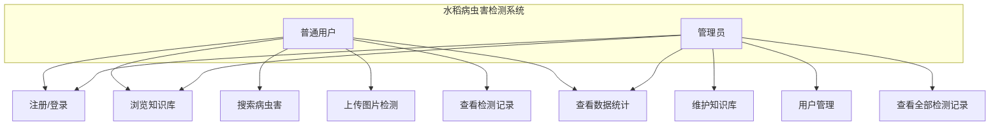

# 水稻病虫害检测系统 - 需求分析文档

## 一、项目背景

水稻是我国最重要的粮食作物之一，全国水稻种植面积约占粮食作物总面积的30%，产量接近粮食总产量的一半。水稻病虫害是影响水稻产量和品质的重要因素，常见的水稻病害包括稻瘟病、纹枯病、白叶枯病、稻曲病等，常见害虫包括稻飞虱、稻纵卷叶螟、二化螟等。

传统的水稻病虫害诊断主要依靠农业技术人员的人工观察和经验判断，存在以下问题：
1. **诊断效率低**：人工观察需要专业人员到田间实地查看，耗时较长；
2. **对专家依赖度高**：普通农户缺乏专业知识，难以准确识别病虫害类型；
3. **防治时机延误**：由于诊断不及时，往往错过最佳防治时期，造成减产。

随着深度学习和计算机视觉技术的发展，基于图像识别的病虫害自动检测成为可能。本系统旨在利用 ASP.NET Core 后端与 ML.NET 机器学习框架，构建一套水稻病虫害智能检测系统，帮助农户通过上传水稻图片快速识别病虫害类型，并获取相应的防治建议。

## 二、研究意义

### 2.1 理论意义
- 探索深度学习模型在农业病虫害识别领域的应用；
- 验证 ML.NET 在 .NET 平台上进行图像推理的可行性；
- 为农业信息化系统的设计与实现提供参考。

### 2.2 实践意义
- 降低农户识别病虫害的技术门槛，提高诊断效率；
- 及时提供防治建议，减少病虫害造成的产量损失；
- 积累病虫害检测数据，为后续模型优化提供数据支撑。

## 三、技术选型理由

| 技术 | 选型理由 |
|------|----------|
| ASP.NET Core 8 | 跨平台、高性能、生态成熟，适合构建企业级Web应用 |
| Entity Framework Core 8 | Code First 模式，便于数据库迁移和版本管理 |
| SQLite | 轻量级关系数据库，无需独立安装数据库服务，便于部署演示 |
| Razor + Bootstrap 5 | 服务端渲染，开发效率高，Bootstrap 提供响应式UI组件 |
| ML.NET + ONNX | 微软官方机器学习框架，支持加载 ONNX 预训练模型进行图像推理 |
| ECharts | 功能强大的图表库，用于数据统计可视化 |
| ASP.NET Core Identity | 官方身份认证方案，提供用户、角色、密码加密等完整功能 |

## 四、功能需求

### 4.1 用户管理模块
- **FR-01 注册**：用户可通过用户名、密码、手机号注册账号
- **FR-02 登录**：已注册用户可登录系统
- **FR-03 角色管理**：系统分为管理员和普通用户两种角色
- **FR-04 个人信息**：用户可查看和修改个人信息

### 4.2 病虫害知识库模块
- **FR-05 知识库浏览**：用户可浏览所有水稻病虫害信息
- **FR-06 知识检索**：用户可按名称、类别搜索病虫害
- **FR-07 详情查看**：用户可查看病虫害的详细信息（症状、危害、防治方法、图片）
- **FR-08 知识维护**：管理员可新增、编辑、删除病虫害知识

### 4.3 图像检测模块
- **FR-09 图片上传**：用户可上传水稻叶片或植株图片
- **FR-10 模型推理**：系统调用 ML.NET 加载 ONNX 模型对图片进行分类推理
- **FR-11 结果展示**：展示识别出的病虫害类型、置信度、防治建议
- **FR-12 记录保存**：自动保存检测记录（图片、结果、时间、用户）

### 4.4 检测记录模块
- **FR-13 记录查询**：用户可查看自己的历史检测记录
- **FR-14 记录详情**：用户可查看单次检测的完整信息
- **FR-15 记录删除**：用户可删除自己的检测记录
- **FR-16 全部记录**：管理员可查看所有用户的检测记录

### 4.5 数据统计模块
- **FR-17 检测趋势**：按时间统计检测次数趋势图
- **FR-18 病虫害分布**：统计各病虫害类型的检测占比饼图
- **FR-19 用户统计**：统计注册用户数、活跃用户数

### 4.6 系统管理模块
- **FR-20 用户管理**：管理员可查看、禁用、删除用户
- **FR-21 角色分配**：管理员可分配用户角色
- **FR-22 系统日志**：记录关键操作日志

## 五、非功能需求

| 编号 | 需求 | 说明 |
|------|------|------|
| NFR-01 | 性能 | 单次图像检测响应时间不超过 5 秒 |
| NFR-02 | 可用性 | 界面简洁友好，操作流程清晰，农户可快速上手 |
| NFR-03 | 安全性 | 密码采用哈希加密存储，接口进行角色权限校验 |
| NFR-04 | 兼容性 | 支持主流浏览器（Chrome、Edge、Firefox） |
| NFR-05 | 可维护性 | 代码分层清晰，使用依赖注入，便于扩展 |
| NFR-06 | 可靠性 | 图片上传和检测过程稳定，异常情况给出友好提示 |

## 六、用例图

## 七、功能模块清单

| 模块 | 子功能 | 权限 |
|------|--------|------|
| 用户管理 | 注册、登录、登出、修改密码、个人信息 | 全部用户 |
| 病虫害知识库 | 列表浏览、详情查看、搜索 | 全部用户 |
| 病虫害知识库 | 新增、编辑、删除 | 管理员 |
| 图像检测 | 图片上传、模型推理、结果展示 | 登录用户 |
| 检测记录 | 我的记录、记录详情、删除记录 | 登录用户 |
| 检测记录 | 全部记录 | 管理员 |
| 数据统计 | 检测趋势、病虫害分布、用户统计 | 全部用户 |
| 系统管理 | 用户列表、禁用/启用、角色分配 | 管理员 |

## 八、数据需求

系统主要涉及以下数据实体：
1. **用户（User）**：用户名、密码哈希、邮箱、手机号、角色、创建时间
2. **病虫害（Pest）**：名称、类别（病害/虫害）、症状描述、危害描述、防治方法、图片路径
3. **检测记录（DetectionRecord）**：用户ID、图片路径、识别结果、置信度、检测时间
4. **系统日志（Log）**：操作人、操作类型、操作内容、时间

---

> **说明**：以上需求分析文档为 AI 辅助生成草稿，需经人工审阅和修改后作为正式需求文档。
