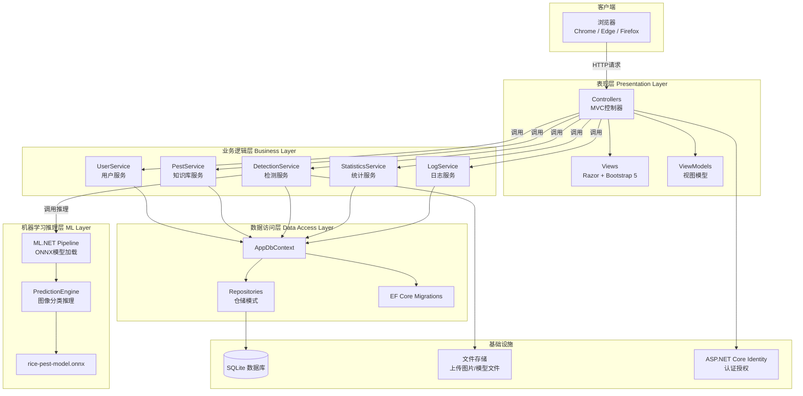
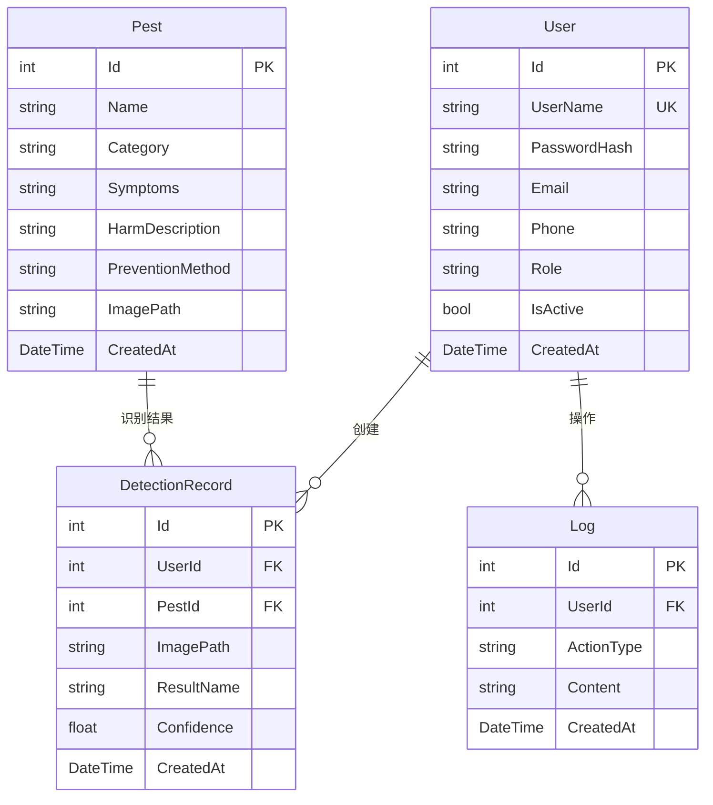
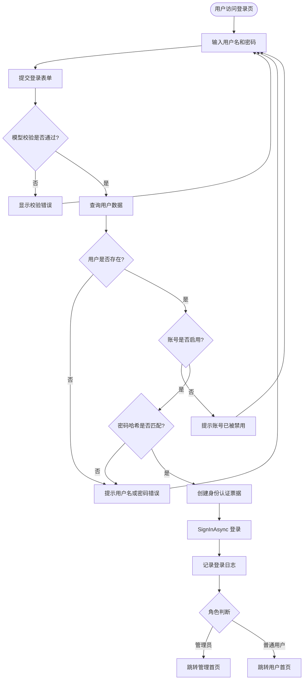
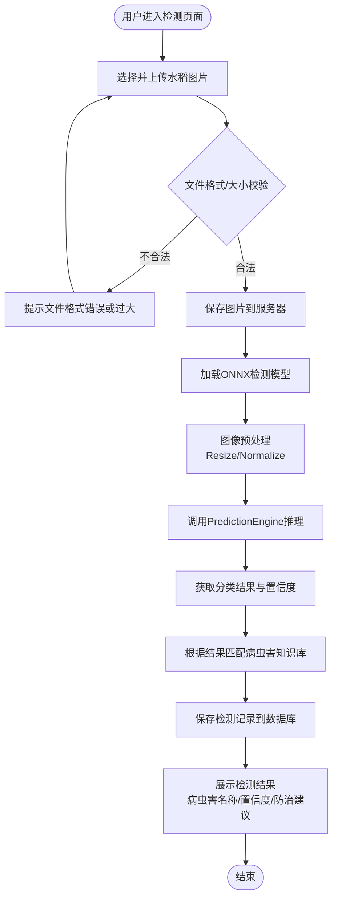
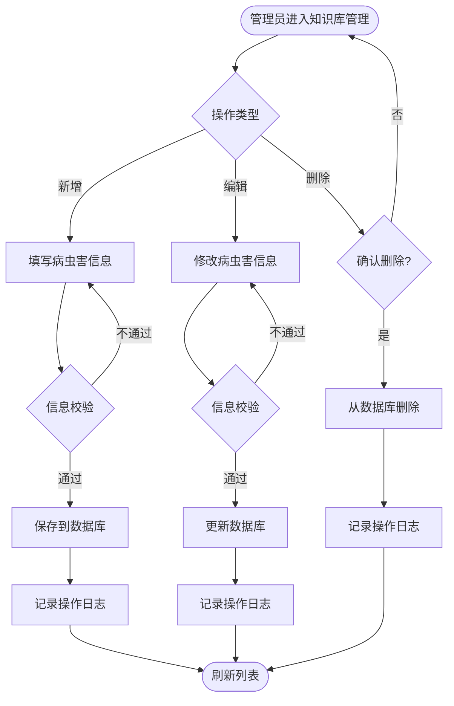
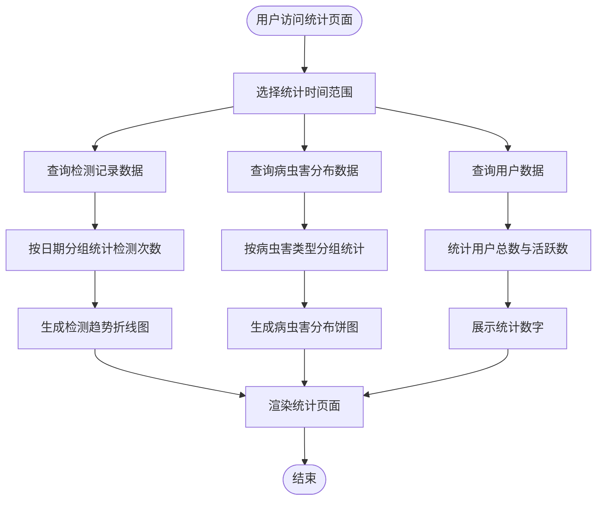

# 水稻病虫害检测系统 - 系统设计文档

## 一、系统架构设计

### 1.1 总体架构图

系统采用经典的四层分层架构，自上而下分别为表现层、业务逻辑层、数据访问层和机器学习推理层。



### 1.2 各层职责说明

| 层次 | 职责 | 包含组件 |
|------|------|----------|
| 表现层 | 接收用户请求、返回视图、数据校验 | Controllers、Views、ViewModels |
| 业务逻辑层 | 核心业务逻辑、事务控制、权限校验 | 各Service类 |
| 数据访问层 | 数据库CRUD、迁移管理 | AppDbContext、Repositories |
| 机器学习层 | ONNX模型加载、图像预处理、推理 | ML.NET Pipeline、PredictionEngine |
| 基础设施 | 数据持久化、文件存储、认证 | SQLite、文件系统、Identity |

## 二、数据库设计

### 2.1 E-R 图



### 2.2 数据表详细设计

#### 表1：Users（用户表）

| 字段名 | 类型 | 约束 | 说明 |
|--------|------|------|------|
| Id | int | PK, Identity | 主键 |
| UserName | nvarchar(50) | NOT NULL, UNIQUE | 用户名 |
| PasswordHash | nvarchar(200) | NOT NULL | 密码哈希 |
| Email | nvarchar(100) | NULL | 邮箱 |
| Phone | nvarchar(20) | NULL | 手机号 |
| Role | nvarchar(20) | NOT NULL, DEFAULT 'User' | 角色（Admin/User） |
| IsActive | bit | NOT NULL, DEFAULT 1 | 是否启用 |
| CreatedAt | datetime | NOT NULL | 创建时间 |

#### 表2：Pests（病虫害表）

| 字段名 | 类型 | 约束 | 说明 |
|--------|------|------|------|
| Id | int | PK, Identity | 主键 |
| Name | nvarchar(50) | NOT NULL | 病虫害名称 |
| Category | nvarchar(20) | NOT NULL | 类别（Disease病害/Pest虫害） |
| Symptoms | nvarchar(1000) | NULL | 症状描述 |
| HarmDescription | nvarchar(1000) | NULL | 危害描述 |
| PreventionMethod | nvarchar(1000) | NULL | 防治方法 |
| ImagePath | nvarchar(200) | NULL | 示例图片路径 |
| CreatedAt | datetime | NOT NULL | 创建时间 |

#### 表3：DetectionRecords（检测记录表）

| 字段名 | 类型 | 约束 | 说明 |
|--------|------|------|------|
| Id | int | PK, Identity | 主键 |
| UserId | int | FK → Users.Id | 用户ID |
| PestId | int | FK → Pests.Id, NULL | 识别出的病虫害ID |
| ImagePath | nvarchar(200) | NOT NULL | 上传图片路径 |
| ResultName | nvarchar(50) | NOT NULL | 识别结果名称 |
| Confidence | float | NOT NULL | 置信度（0-1） |
| CreatedAt | datetime | NOT NULL | 检测时间 |

#### 表4：Logs（系统日志表）

| 字段名 | 类型 | 约束 | 说明 |
|--------|------|------|------|
| Id | int | PK, Identity | 主键 |
| UserId | int | FK → Users.Id, NULL | 操作人ID |
| ActionType | nvarchar(50) | NOT NULL | 操作类型 |
| Content | nvarchar(500) | NULL | 操作内容 |
| CreatedAt | datetime | NOT NULL | 操作时间 |

## 三、核心业务流程设计

### 3.1 用户登录流程



### 3.2 图像检测业务流程



### 3.3 病虫害知识维护流程（管理员）



### 3.4 数据统计流程



## 四、目录结构设计

```
RicePestDetection/
├── RicePestDetection.sln
├── src/
│   └── RicePestDetection.Web/
│       ├── Controllers/
│       │   ├── AccountController.cs        # 登录注册
│       │   ├── HomeController.cs           # 首页
│       │   ├── PestController.cs           # 知识库
│       │   ├── DetectionController.cs      # 图像检测
│       │   ├── RecordController.cs         # 检测记录
│       │   ├── StatisticsController.cs     # 数据统计
│       │   ├── AdminController.cs          # 系统管理
│       │   └── LogController.cs            # 系统日志
│       ├── Views/
│       │   ├── Account/
│       │   ├── Home/
│       │   ├── Pest/
│       │   ├── Detection/
│       │   ├── Record/
│       │   ├── Statistics/
│       │   ├── Admin/
│       │   ├── Shared/
│       │   └── _ViewImports.cshtml
│       ├── Models/
│       │   ├── User.cs
│       │   ├── Pest.cs
│       │   ├── DetectionRecord.cs
│       │   └── Log.cs
│       ├── ViewModels/
│       │   ├── LoginViewModel.cs
│       │   ├── RegisterViewModel.cs
│       │   ├── PestViewModel.cs
│       │   ├── DetectionResultViewModel.cs
│       │   └── StatisticsViewModel.cs
│       ├── Services/
│       │   ├── IUserService.cs
│       │   ├── UserService.cs
│       │   ├── IPestService.cs
│       │   ├── PestService.cs
│       │   ├── IDetectionService.cs
│       │   ├── DetectionService.cs
│       │   ├── IStatisticsService.cs
│       │   ├── StatisticsService.cs
│       │   ├── ILogService.cs
│       │   ├── LogService.cs
│       │   └── MLPredictionService.cs      # ML.NET推理服务
│       ├── Data/
│       │   ├── AppDbContext.cs
│       │   ├── Migrations/
│       │   └── SeedData.cs
│       ├── wwwroot/
│       │   ├── css/
│       │   ├── js/
│       │   ├── images/
│       │   └── uploads/                      # 用户上传图片
│       ├── Program.cs
│       └── appsettings.json
├── models/
│   └── rice-pest-model.onnx                 # ONNX检测模型
├── tests/
│   └── RicePestDetection.Tests/
│       ├── Services/
│       └── RicePestDetection.Tests.csproj
├── experiments/
├── docs/
│   ├── requirements-analysis.md
│   ├── system-design.md
│   └── paper/
├── Dockerfile
└── README.md
```

## 五、接口设计要点

### 5.1 控制器路由设计

| 控制器 | 路由前缀 | 主要Action |
|--------|----------|------------|
| AccountController | /Account | Login, Logout, Register |
| HomeController | / | Index |
| PestController | /Pest | Index, Details, Create, Edit, Delete |
| DetectionController | /Detection | Index, Upload, Result |
| RecordController | /Record | Index, Details, Delete |
| StatisticsController | /Statistics | Index |
| AdminController | /Admin | Users, EditUser, ToggleActive |
| LogController | /Log | Index |

### 5.2 ML推理服务接口

```csharp
public interface IMLPredictionService
{
    // 加载ONNX模型（启动时执行一次）
    void LoadModel(string modelPath);

    // 对图片进行推理，返回预测结果
    Task<DetectionPrediction> PredictAsync(string imagePath);
}

public class DetectionPrediction
{
    public string Label { get; set; }        // 病虫害名称
    public float Confidence { get; set; }    // 置信度
    public Dictionary<string, float> Scores { get; set; }  // 各类别得分
}
```

---

> **说明**：以上系统设计文档为 AI 辅助生成草稿，需经人工审阅和修改后作为正式设计文档。
